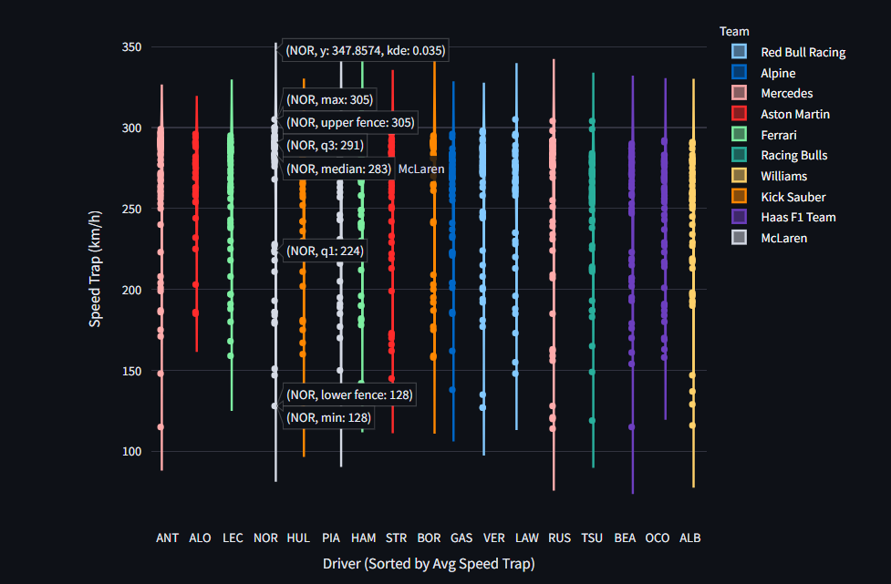
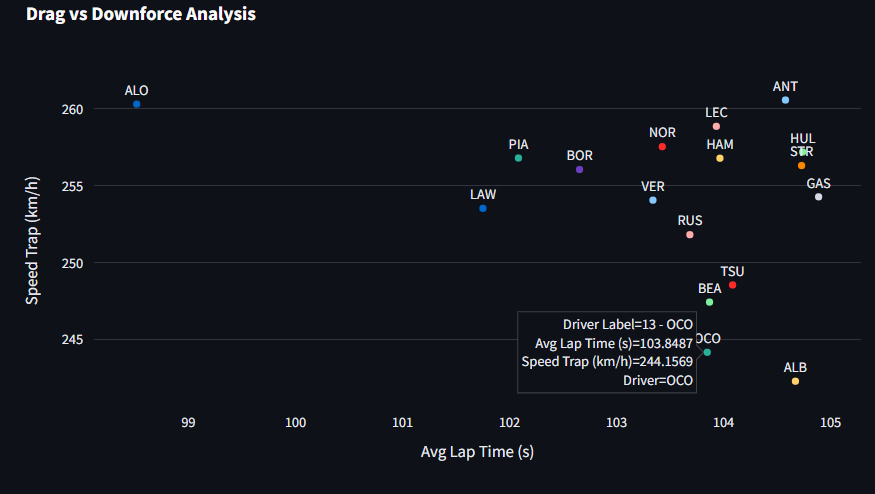
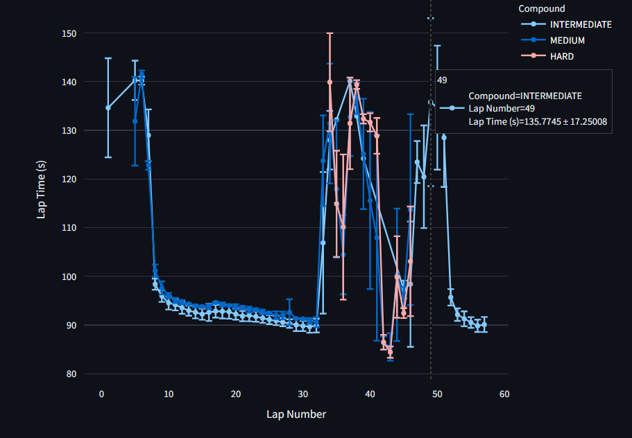
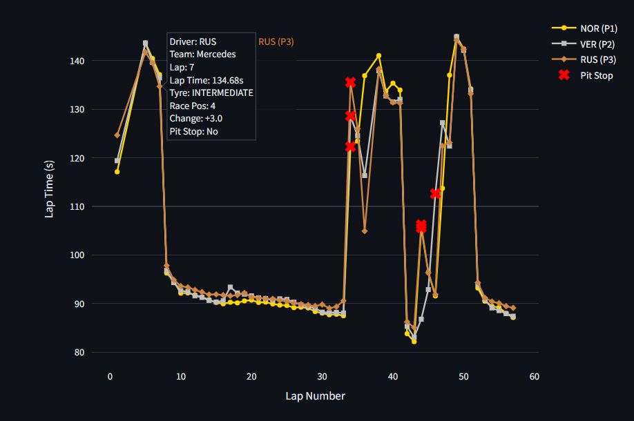

# *****Ever wondered what makes an F1 car blisteringly fast? Or why some strategies backfire spectacularly?***

### Welcome to ****F1 Race Analysis Dashboard**** 🏎️ - Your pit wall companion for decoding Formula 1 races!

### What's Under the Hood?

### 1. Speed Trap Distribution - Who’s the fastest on the straights? 💨 


- Violin plot of speed trap readings for each driver
- Sorted by average performance
- Colored by team
- Insightful interpretation of team setup philosophy

### 2. Drag vs Downforce - The eternal battle of speed vs. grip! ⚖️


- Scatter plot of average lap time vs top speed
- Shows setup tradeoffs (low drag vs high downforce)
- Driver finishing position indicated in the legend

### 3. Tyre Degradation - Who’s burning rubber the fastest? 🛞🔥


- Compound-wise average lap time over race distance
- Error bars indicate variability
- Shows how different tyre compounds age during a race

### 4. Race Pace & Strategy (Top 3 drivers) - Was it a masterstroke or a disaster class? 🤔


- Lap-by-lap graph of top 3 finishers
- Pit stop markers
- Driver position changes from start to finish
- Highlights undercut strategies and consistency

Just pick any **Grand Prix (2022 onwards)** and watch the data unfold like a team principal’s war room!

So, whether you’re a data nerd, a strategy buff, or just here to prove that your favorite driver deserved better, this dashboard is for you!

## Fire it up with:

https://formula1-dashboard.streamlit.app/

---

## Install dependencies:
```bash
pip install -r requirements.txt
```
## Run the App (local)
```bash
streamlit run f1_dashboard.py
```
## License
MIT License

## Author
Made with fuel and finesse by **Siddharth** 


